# IAM Basics Lab - Solution

**Student Name:** France van Maanen 
**Date Completed:** 21 April

---

## Exercise 1: IAM Groups

### Screenshots:
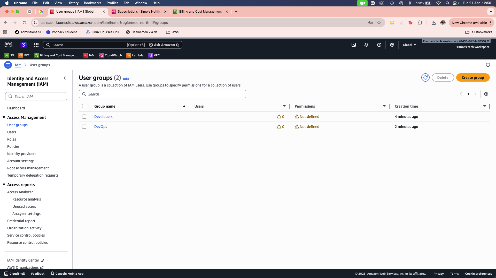

### Groups Created:
- [x] Developers group
- [x] DevOps group

---

## Exercise 2: Group Permissions

### Developers Group:
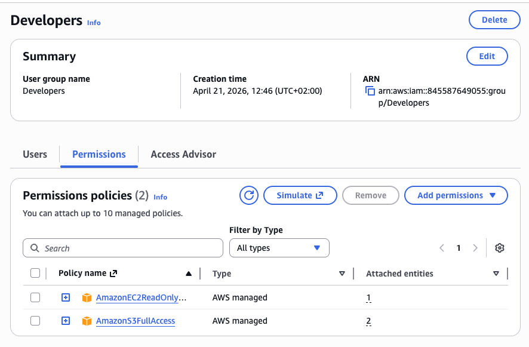

**Policies Attached:**
- AmazonS3FullAccess
- AmazonEC2ReadOnlyAccess

### DevOps Group:
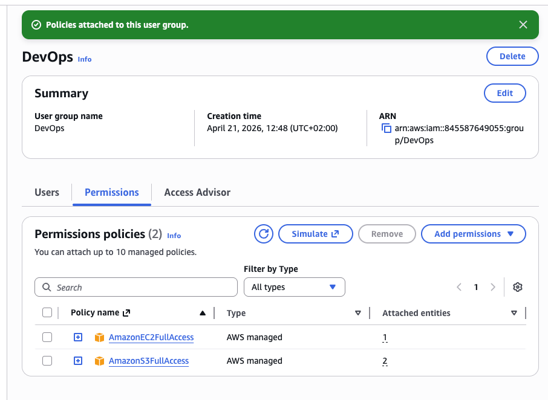

**Policies Attached:**
- AmazonS3FullAccess
- AmazonEC2FullAccess

---

## Exercise 3: IAM Users

### Screenshots:
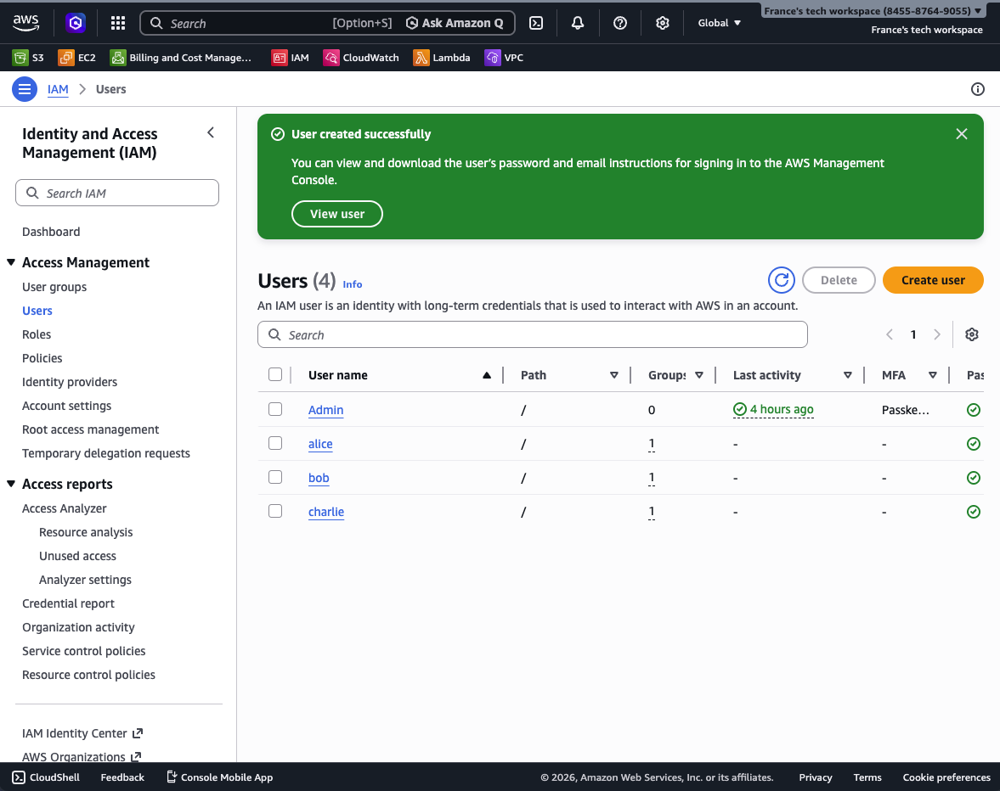

### Users Created:

| Username | Group | Console Access | Status |
|----------|-------|----------------|--------|
| alice | Developers | Yes | ✅ Created |
| bob | Developers | Yes | ✅ Created |
| charlie | DevOps | Yes | ✅ Created |

---

## Exercise 4: Permission Testing

### Alice's Access Tests:

**S3 Access:**
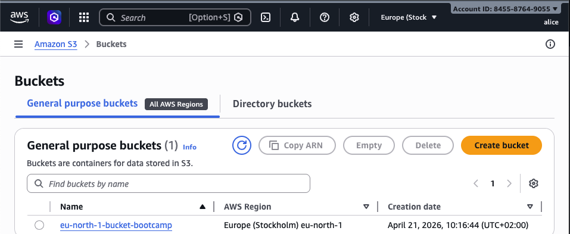
- Create bucket: ✅ SUCCESS
- Upload file: ✅ SUCCESS

**EC2 Access:**
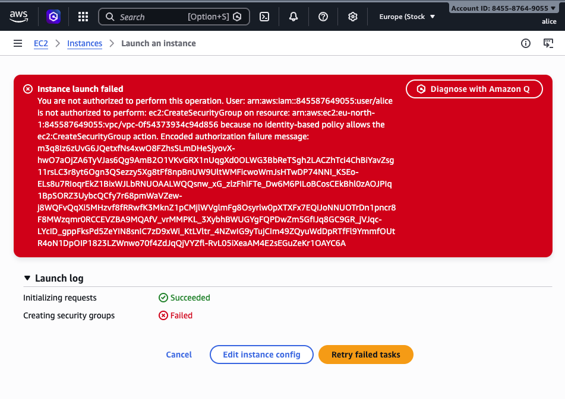
- View instances: ✅ SUCCESS
- Launch instance: ❌ DENIED (Expected)

### Bob's Access Tests:

**S3 Access:**
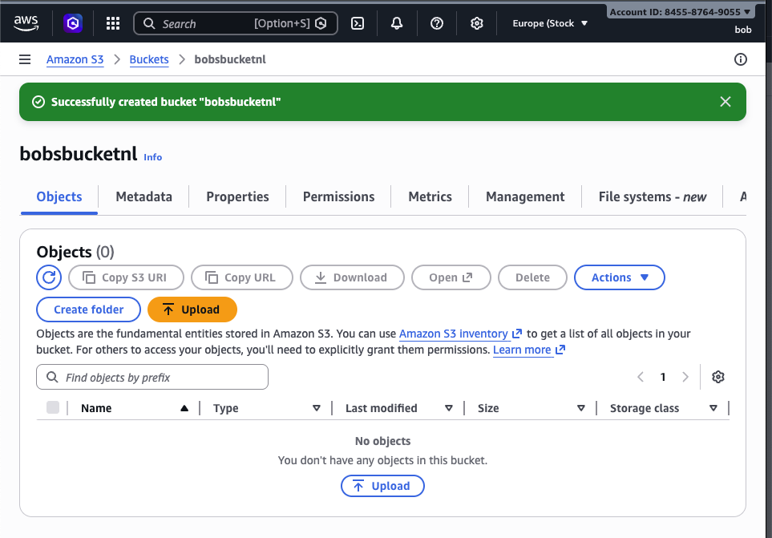
- Create bucket: ✅ SUCCESS

**EC2 Access:**
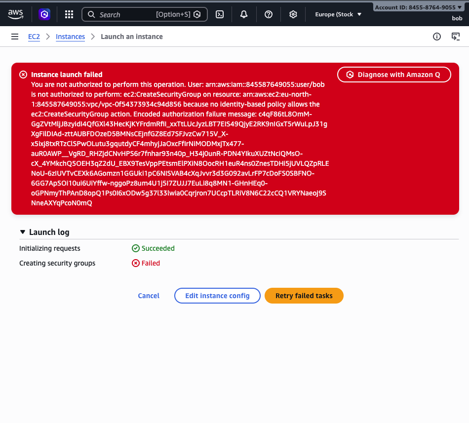
- View instances: ✅ SUCCESS
- Launch instance: ❌ DENIED (Expected)

### Charlie's Access Tests:

**Full Access:**
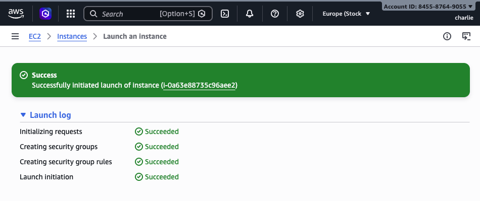
- S3 create bucket: ✅ SUCCESS
- EC2 launch instance: ✅ SUCCESS

### Summary of Test Results:

| User | S3 Full | EC2 View | EC2 Launch | Result |
|------|---------|----------|------------|--------|
| alice | ✅ | ✅ | ❌ | As expected |
| bob | ✅ | ✅ | ❌ | As expected |
| charlie | ✅ | ✅ | ✅ | As expected |

---

## Exercise 5: Custom Policy

### Policy JSON:
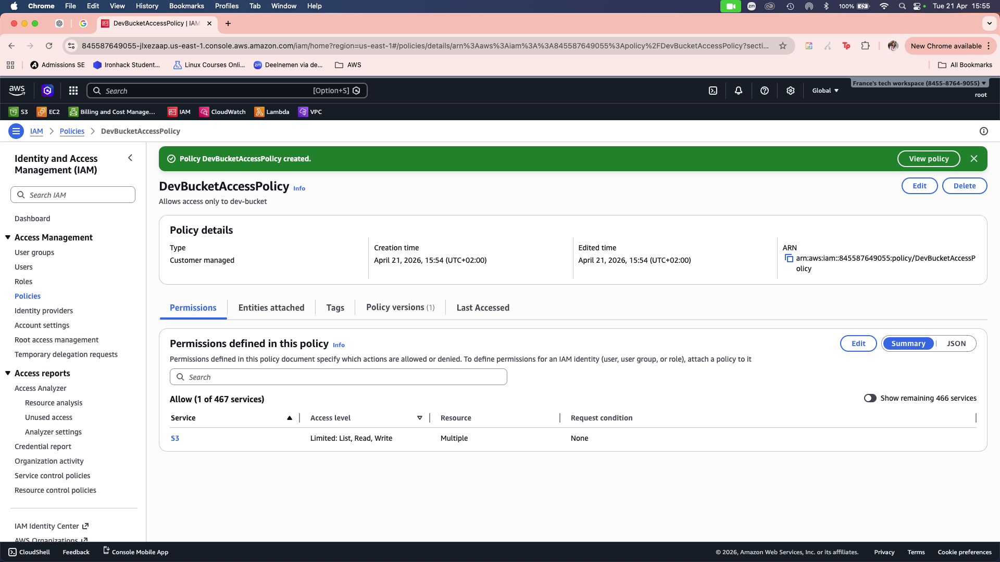

```json
{
    "Version": "2012-10-17",
    "Statement": [
        {
            "Sid": "ListAllBuckets",
            "Effect": "Allow",
            "Action": "s3:ListAllMyBuckets",
            "Resource": "*"
        },
        {
            "Sid": "DevBucketAccess",
            "Effect": "Allow",
            "Action": [
                "s3:ListBucket",
                "s3:GetObject",
                "s3:PutObject",
                "s3:DeleteObject"
            ],
            "Resource": [
                "arn:aws:s3:::dev-bucket",
                "arn:aws:s3:::dev-bucket/*"
            ]
        }
    ]
}
```

### Custom Policy Test:
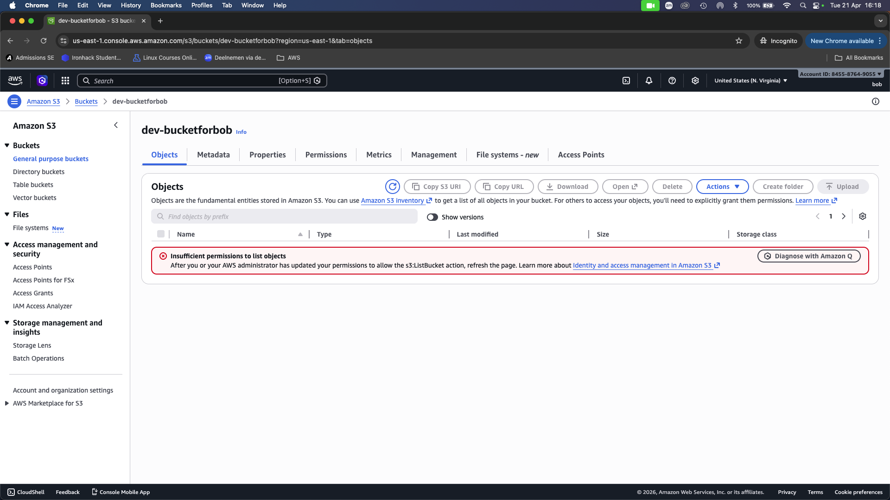

**Bob's Access After Custom Policy:**
- Access dev-bucket: ✅ SUCCESS
- Access other buckets: ❌ DENIED (Expected)

---

## Exercise 6: MFA Configuration


**MFA Details:**
- User: [alice / admin user]
- Device type: Virtual MFA
- Authenticator app: [Google Authenticator / Microsoft Authenticator / Authy]
- Status: ✅ Active

---

## Bonus Challenges

### Challenge 1: Password Policy

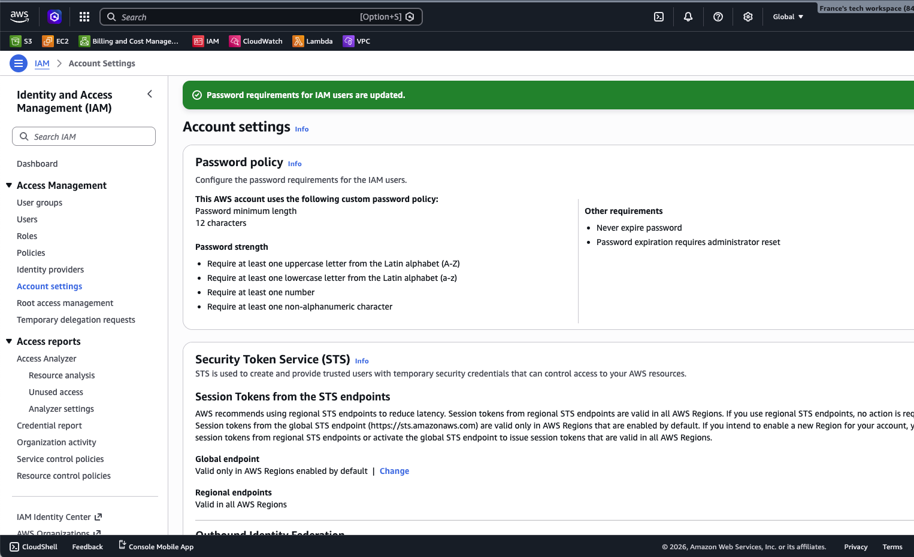

**Policy Settings:**
- [x] Minimum length: 12 characters
- [x] Require uppercase letters
- [x] Require lowercase letters
- [x] Require numbers
- [x] Require symbols
- [x] Password expiration: 90 days

---

### Challenge 2: Access Analyzer

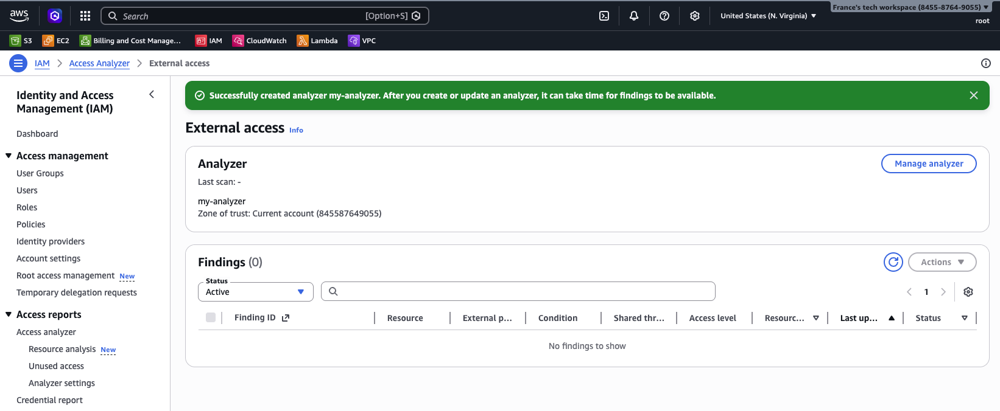

**Findings:**
- Number of findings: [X]
- Critical issues: [List any public access found]
- Recommendations: [Your notes]

---

### Challenge 3: CLI Access Keys

**Alice Access Key Created:** Yes

**CLI Test Output:**
```bash
$ aws s3 ls --profile alice
[Paste output here]
```

**Screenshot:** (screenshots/terminal-output.png)

---

## Reflection Questions

### 1. Why use groups instead of attaching policies directly to users?

**Your Answer:**

[By using groups, set up could be efficient and user role is clear as users will are isolated.]

---

### 2. What are the risks of giving everyone AdministratorAccess?

**Your Answer:**

Mainly security risks and unnecessary actions that might cause disruption to the workflow. 

---

### 3. How would you organize IAM for 50 developers across 5 projects?

**Your Answer:**

I would organize it depending on roles of users within the project. I would give them roles-based access depending on what their tasks involving different groups and tools. 

---

### 4. What happens if you delete an IAM user? Can you recover their permissions?

**Your Answer:**

yes it is permanent. The best solution is to reconstruct users permissions and access audit logs on cloudtrail to rebuild manually. 

---

## Key Learnings

**What was most challenging about this lab?**

This lab in my opinion was the easiest so far. The only thing that I might had a challenge with is differentiating the definition of "roles" and permission policies. 

---

**What IAM best practice will you always follow?**

Giving the most minimal access to each user. Only the necessities, anything else is a role. 

---

**How does IAM help implement the principle of least privilege?**

It gives precision and flexibility needed to conitnously tighten access down. 

---

## Checklist

- [ ] All 3 users created (alice, bob, charlie)
- [ ] Both groups created (Developers, DevOps)
- [ ] Permissions tested for each user
- [ ] Custom policy created and tested
- [ ] MFA enabled for at least one user
- [ ] All screenshots captured
- [ ] All reflection questions answered
- [ ] Policy JSON file saved
- [ ] Work committed to Git
- [ ] Pull request created

---

**Completed By:** [Your Name]  
**Date:** [Date]
